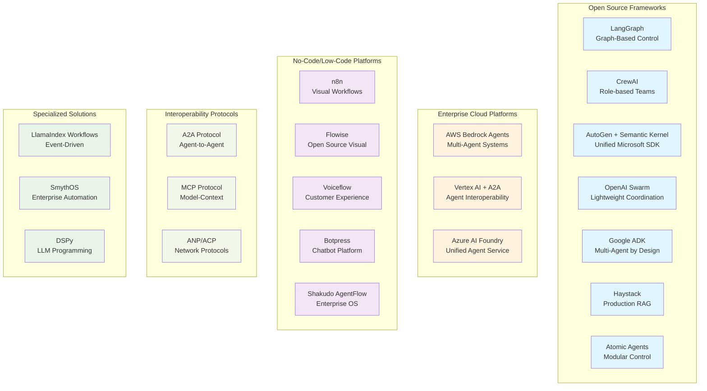

# Platform Ecosystem: LangGraph alternatives (May 2025)

**Research Date**: May 28, 2025  
**Status**: Current as of major industry announcements

> **Note on LangChain/LangGraph's Industry Impact**: While this analysis focuses on alternatives, it's important to acknowledge LangChain and LangGraph's foundational role in the agentic AI ecosystem. LangChain pioneered many of the abstractions and patterns we see across all frameworks today—from tool integration and memory management to agent orchestration concepts. LangGraph further advanced the field by demonstrating how graph-based architectures could provide precise control over agent workflows. These innovations helped identify and establish industry standards and design patterns that have influenced virtually every framework discussed below, creating a more mature and interoperable ecosystem for all developers.

---

## 🚀 Major Industry Developments (2025)

### Microsoft Build 2025 (May 19, 2025)
- **Azure AI Foundry Agent Service** now Generally Available[1]
- **Unified SDK**: <cite>"bringing Semantic Kernel and AutoGen into a single, developer-focused SDK"</cite>[1]
- **Interoperability**: <cite>"Agent-to-Agent (A2A) and Model Context Protocol (MCP) support"</cite>[1]
- **Enterprise Focus**: Multi-agent orchestration for complex business tasks

### Google I/O 2025 
- **Agent Development Kit (ADK)** <cite>"introduced at Google Cloud NEXT 2025, a new open-source framework designed to simplify the full stack end-to-end development of agents and multi-agent systems"</cite>[2]
- **Agent2Agent (A2A) Protocol** <cite>"launched with support and contributions from more than 50 technology partners like Atlassian, Box, Cohere, Intuit, Langchain, MongoDB, PayPal, Salesforce, SAP, ServiceNow, UKG and Workday"</cite>[3]
- **Agent Mode**: <cite>"an experimental feature where you will be able to simply describe your end goal and Gemini can get things done on your behalf"</cite>[4]
- **Agent Garden**: Collection of ready-to-use agent samples and tools

### The Protocol Wars: A2A vs MCP
- **A2A (Agent2Agent)**: Google-led, focuses on agent-to-agent communication
- **MCP (Model Context Protocol)**: Anthropic-led, focuses on model-context integration
- **Industry Relationship**: <cite>"Agentic applications need both A2A and MCP - MCP for tools and A2A for agents"</cite>[5]
- **Enterprise Adoption**: <cite>"50+ technology partners including Atlassian, Box, Cohere, Intuit, LangChain, MongoDB, PayPal, Salesforce, SAP, ServiceNow, UKG and Workday"</cite>[3]

---

## Platform Ecosystem Overview

The following diagram illustrates the current landscape of LangGraph alternatives, organized by platform type and updated with the latest 2025 developments:

---

## 1. Open Source Frameworks (Updated)

### 🆕 Google ADK (Agent Development Kit)
- **Status**: <cite>"ADK is the same framework powering agents within Google products like Agentspace and the Google Customer Engagement Suite (CES)"</cite>[2]
- **Architecture**: <cite>"Multi-Agent by Design: Build modular and scalable applications by composing multiple specialized agents in a hierarchy"</cite>[2]
- **Features**: 
  - <cite>"bidirectional audio and video streaming capabilities"</cite>[2]
  - <cite>"Choose the model that works best for your needs - whether it is Gemini or any model accessible via Vertex AI Model Garden"</cite>[2]
  - <cite>"over 100 pre-built connectors"</cite>[6]
  - Rich tool ecosystem integration with LangChain, LlamaIndex, CrewAI
- **Best For**: Complex multi-agent systems, enterprise applications
- **Repository**: [Google Cloud ADK](https://google.github.io/adk-docs/)

### 🆕 PydanticAI (December 2024)
- **Status**: <cite>"Python agent framework designed to make it less painful to build production grade applications with Generative AI"</cite>[13]
- **Philosophy**: <cite>"Built with one simple aim: to bring that FastAPI feeling to GenAI app development"</cite>[13]
- **Strengths**:
  - <cite>"Built by the team behind Pydantic (the validation layer of the OpenAI SDK, the Anthropic SDK, LangChain, LlamaIndex, AutoGPT, Transformers, CrewAI, Instructor and many more)"</cite>[13]
  - Type-safe with static type checking integration (mypy, pyrite)
  - <cite>"Model-agnostic: Supports OpenAI, Anthropic, Gemini, Deepseek, Ollama, Groq, Cohere, and Mistral"</cite>[13]
  - Dependency injection system for testing and production
- **Best For**: Production-grade applications requiring type safety and validation
- **Repository**: [GitHub - pydantic/pydantic-ai](https://github.com/pydantic/pydantic-ai)

### 🆕 AG2 (Community Fork)
- **Status**: <cite>"AG2 is not a new framework — it's a rebranded version of AutoGen 0.2.34, now continuing under the name AG2"</cite>[14]
- **Governance**: <cite>"Community-driven with an Open RFC process"</cite>[14]
- **Strengths**: 
  - <cite>"Full backward compatibility, no breaking changes planned"</cite>[15]
  - Maintains familiar AutoGen 0.2 architecture
  - Community-driven development and support
- **Best For**: Teams wanting stability and familiar AutoGen patterns without Microsoft's enterprise direction
- **Repository**: [AG2 GitHub Organization](https://github.com/ag2ai)

### 🆕 Atomic Agents
- **Philosophy**: <cite>"Businesses need AI systems that produce consistent, reliable outputs aligned with their brand and objectives"</cite>[7]
- **Architecture**: <cite>"designed around the concept of atomicity to be an extremely lightweight and modular framework"</cite>[7]
- **Strengths**:
  - <cite>"Define clear input and output schemas to ensure consistent behavior"</cite>[7]
  - <cite>"Fine-tune each part of the system individually, from system prompts to tool integrations"</cite>[7]
  - <cite>"built on top of Instructor and leverages the power of Pydantic for data and schema validation"</cite>[7]
  - Multi-provider support via Instructor compatibility
- **Best For**: Businesses requiring consistent, brand-aligned outputs
- **Repository**: [GitHub - BrainBlend-AI/atomic-agents](https://github.com/BrainBlend-AI/atomic-agents)

### 🔄 Microsoft AutoGen + Semantic Kernel (Unified)
- **Major Change**: Previously separate frameworks now unified in Azure AI Foundry
- **New Features**: 
  - Single developer-focused SDK
  - A2A and MCP protocol support
  - Enhanced observability and monitoring
  - Microsoft Entra Agent ID for security
- **Best For**: Enterprise Microsoft ecosystem integration
- **Transition**: Existing AutoGen users can migrate to unified experience

### CrewAI (Continued Leadership in Simplicity)
- **Status**: <cite>"CrewAI specializes in creating intelligent agents capable of collaborating, sharing tasks, and optimizing actions through real-time communication and decision-making"</cite>[8]
- **Strengths**: Role-based agent teams, intuitive setup, fast development
- **Assessment**: <cite>"CrewAI prioritizes simplicity"</cite> and is <cite>"well-suited for startups focused on building collaborative AI systems"</cite>[8]
- **Best For**: Startups, rapid iteration, team-based workflows

### OpenAI Swarm (Experimental)
- **Status**: Lightweight, experimental framework
- **Focus**: Dynamic agent handoffs and coordination
- **Best For**: Research, prototyping, simple multi-agent scenarios

### Other Established Frameworks
- **Haystack**: Production-ready RAG applications, component-based architecture
- **LlamaIndex Workflows**: Event-driven agent systems
- **DSPy**: Programming framework for LLM optimization
- **OpenAI Agents SDK**: <cite>"Production-ready upgrade of our previous experimentation for agents, Swarm"</cite>[16]

### 🆕 Developer-Focused Tools

#### **Instructor** - Structured Output Foundation
- **Status**: <cite>"The most popular Python library for working with structured outputs from large language models (LLMs), boasting over 1 million monthly downloads"</cite>[18]
- **Core Purpose**: <cite>"Built on top of Pydantic, it provides a simple, transparent, and user-friendly API to manage validation, retries, and streaming responses"</cite>[18]
- **Why It's Foundational**: <cite>"Built by the team behind Pydantic (the validation layer of the OpenAI SDK, the Anthropic SDK, LangChain, LlamaIndex, AutoGPT, Transformers, CrewAI, Instructor and many more)"</cite>[13]
- **Key Features**:
  - <cite>"Response Models: Specify Pydantic models to define the structure of your LLM outputs"</cite>[18]
  - <cite>"Retry Management: Easily configure the number of retry attempts for your requests"</cite>[18]
  - <cite>"Flexible Backends: Seamlessly integrate with various LLM providers beyond OpenAI"</cite>[18]
- **Multi-Provider Support**: OpenAI, Anthropic, Gemini, Ollama, Groq, Cohere, LiteLLM
- **Best For**: Type-safe structured outputs, foundation for other frameworks
- **Repository**: [GitHub - instructor-ai/instructor](https://github.com/567-labs/instructor)

#### **Marvin** - Lightweight AI Toolkit  
- **Status**: <cite>"A lightweight AI engineering framework for building natural language interfaces that are reliable, scalable, and easy to trust"</cite>[19]
- **Developer**: <cite>"Built by the engineering team at Prefect"</cite>[20] (creators of the popular data orchestration platform)
- **Philosophy**: <cite>"Sometimes the most challenging part of working with generative AI is remembering that it's not magic; it's software"</cite>[19]
- **Architecture**: <cite>"Python framework for building agentic AI workflows" with "structured, developer-focused framework for defining workflows and delegating work to LLMs"</cite>[21]
- **Key Features**:
  - <cite>"Task-Centric Architecture: Break complex AI workflows into manageable, observable steps"</cite>[21]
  - <cite>"Rigorously type-hinted, used by thousands of engineers"</cite>[20]
  - <cite>"Built for incremental adoption"</cite>[20] - can be used as serialization library or full engine
- **Current Status**: <cite>"Marvin 3.x is under active development" with API potentially undergoing breaking changes</cite>[21]
- **Best For**: Lightweight agent workflows, incremental AI adoption, structured task orchestration
- **Repository**: [GitHub - PrefectHQ/marvin](https://github.com/PrefectHQ/marvin)

#### **Rivet** - Visual Agent IDE
- **Description**: <cite>"Powerful Integrated Development Environment (IDE) and library for creating AI agents using a visual, graph-based interface"</cite>[17]
- **Components**: Rivet Application (editor/IDE) and Rivet Core/Node (TypeScript libraries)
- **Strengths**: <cite>"Node-based editor enables you to create, configure, and debug complex AI prompt chains and AI agent chains visually"</cite>[17]
- **Best For**: Visual development, debugging agent flows, graph-based agent design

---

---

## 2. Enterprise Cloud Platforms (2025 Updates)

### 🔥 Azure AI Foundry Agent Service (GA)
- **Launch**: May 19, 2025 - General Availability
- **Unified Experience**: AutoGen + Semantic Kernel in single SDK
- **Security**: Microsoft Entra Agent ID for enterprise identity management
- **Protocols**: Native A2A and MCP support
- **Observability**: Built-in performance, quality, cost, and safety metrics
- **Best For**: Enterprise Microsoft environments

### 🔄 Google Vertex AI (Enhanced)
- **New Additions**: 
  - Agent Development Kit integration
  - Agent2Agent protocol support
  - Agent Garden sample library
  - Enhanced multi-agent orchestration
- **Model Support**: 200+ models from various providers
- **Integration**: Over 100 pre-built connectors
- **Best For**: Google Cloud native applications, multi-vendor environments

### 🆕 AWS Bedrock Agents (Multi-Agent)
- **New Capability**: <cite>"Amazon Web Services has released a multi-agent collaboration capability for Amazon Bedrock, introducing a framework for deploying and managing multiple AI agents that collaborate on complex tasks"</cite>[9]
- **Architecture**: <cite>"The system enables specialized agents to work together under a supervisor agent's coordination"</cite>[9]
- **Focus**: Enterprise-scale applications with complex task distribution
- **Best For**: AWS ecosystem, large-scale automation

---

## 3. No-Code/Low-Code Platforms

### n8n (Developer Preferred)
- **Strengths**: 422+ app integrations, visual workflow automation
- **AI Features**: AI agent nodes, LLM integrations, workflow automation
- **Community**: Strong developer community and documentation
- **Best For**: Technical teams wanting visual workflows

### 🆕 Shakudo AgentFlow (Enterprise OS)
- **Positioning**: <cite>"Secure AI agent platform that lets enterprises create and deploy intelligent agents using natural language"</cite>[10]
- **Features**:
  - <cite>"Transform business processes into AI agents using plain English SOWs"</cite>[10]
  - <cite>"Keep your data secure with on-premise deployment, connect to existing databases, and scale from simple tasks to complex multi-agent workflows"</cite>[10]
  - <cite>"uses Model Context Protocol (MCP) to integrate seamlessly with your existing databases, APIs, SaaS tools, and internal systems"</cite>[10]
- **Best For**: Enterprises requiring secure, scalable agent infrastructure
- **Website**: [Shakudo AgentFlow](https://www.shakudo.io/agentflow)

### Flowise (Open Source Visual)
- **Status**: Leading open-source visual agent builder
- **Features**: Drag-and-drop interface, LangChain integration
- **Community**: Active development, strong documentation
- **Best For**: Open-source visual development, customization needs

### Other Platforms
- **Voiceflow**: Customer experience focus, voice/chat integration
- **Botpress**: Chatbot specialization, multi-channel deployment
- **Langflow**: LangChain-based visual workflows

---

## 4. 🆕 Interoperability Protocols (New Category)

### Agent2Agent (A2A) Protocol
- **Launch**: <cite>"Today, we're launching a new, open protocol called Agent2Agent (A2A)"</cite> in April 2025[3]
- **Partners**: <cite>"with support and contributions from more than 50 technology partners like Atlassian, Box, Cohere, Intuit, Langchain, MongoDB, PayPal, Salesforce, SAP, ServiceNow, UKG and Workday"</cite>[3]
- **Technology**: <cite>"JSON-RPC 2.0 over HTTP(S) for request/response interactions"</cite> with <cite>"Server-Sent Events (SSE) for streaming real-time updates"</cite>[11]
- **Purpose**: <cite>"The A2A protocol will allow AI agents to communicate with each other, securely exchange information, and coordinate actions"</cite>[3]
- **Microsoft Adoption**: <cite>"we are committed to advancing open protocols like Agent2Agent (A2A), coming soon to Azure AI Foundry and Copilot Studio"</cite>[12]

### Model Context Protocol (MCP)
- **Provider**: Anthropic
- **Purpose**: Standardize how applications provide context to language models
- **Relationship to A2A**: Complementary - MCP for tools, A2A for agents
- **Enterprise Support**: Microsoft first-party support across platforms

### Emerging Protocols
- **Agent Network Protocol (ANP)**: Decentralized agent communication
- **Agent Communication Protocol (ACP)**: IBM's enterprise-focused standard
- **Industry Trend**: Multiple standards competing for adoption

---

## Competitive Analysis Matrix

| Framework | Enterprise Ready | Ease of Use | Multi-Agent | Protocol Support | Cloud Native |
|-----------|------------------|-------------|-------------|------------------|--------------|
| **Azure AI Foundry** | ⭐⭐⭐⭐⭐ | ⭐⭐⭐⭐ | ⭐⭐⭐⭐⭐ | A2A + MCP | Microsoft |
| **Google ADK** | ⭐⭐⭐⭐⭐ | ⭐⭐⭐ | ⭐⭐⭐⭐⭐ | A2A + MCP | Google |
| **Atomic Agents** | ⭐⭐⭐⭐ | ⭐⭐⭐ | ⭐⭐⭐ | MCP | Agnostic |
| **CrewAI** | ⭐⭐⭐ | ⭐⭐⭐⭐⭐ | ⭐⭐⭐⭐ | Limited | Agnostic |
| **Shakudo AgentFlow** | ⭐⭐⭐⭐⭐ | ⭐⭐⭐⭐ | ⭐⭐⭐⭐ | MCP | Multi-Cloud |
| **n8n** | ⭐⭐⭐ | ⭐⭐⭐⭐⭐ | ⭐⭐ | Limited | Agnostic |
| **LangGraph** | ⭐⭐⭐⭐ | ⭐⭐ | ⭐⭐⭐⭐⭐ | MCP | Agnostic |

---

## Strategic Decision Framework

### Choose Azure AI Foundry If:
- Already in Microsoft ecosystem (Office 365, Azure)
- Need enterprise security and compliance
- Want unified AutoGen + Semantic Kernel experience
- Require both A2A and MCP protocol support

### Choose Google ADK + Vertex AI If:
- Prefer Google Cloud infrastructure
- Need advanced multi-agent coordination
- Want access to diverse model ecosystem (200+ models)
- Require bidirectional streaming capabilities

### Choose Atomic Agents If:
- Prioritize predictable, consistent outputs
- Need fine-grained control over agent behavior
- Want modular, component-based architecture
- Prefer open-source with clear abstractions

### Choose CrewAI If:
- Need rapid prototyping and development
- Want simple, role-based agent teams
- Prefer intuitive, beginner-friendly framework
- Building collaborative AI systems

### Choose Shakudo AgentFlow If:
- Require enterprise-grade security and governance
- Need on-premise deployment options
- Want AI operating system approach
- Prefer natural language agent creation

---

## Future-Proofing Considerations

### Protocol Adoption Strategy
1. **Immediate**: Implement MCP for tool integration
2. **Short-term**: Evaluate A2A for agent communication
3. **Long-term**: Monitor protocol evolution and industry adoption

### Technology Evolution Tracking
- **Google**: Focus on open-source, multi-vendor approach
- **Microsoft**: Enterprise integration and unified developer experience
- **Anthropic**: Context and safety-focused protocols
- **Industry**: Interoperability and standardization trends

### Recommended Approach
1. **Prototype**: Test 2-3 frameworks with your specific use cases
2. **Evaluate**: Consider protocol support for future interoperability
3. **Scale**: Choose based on enterprise requirements and ecosystem alignment
4. **Monitor**: Stay updated on protocol evolution and industry adoption

---

## Key Takeaways for 2025

1. **Interoperability is Critical**: A2A and MCP protocols will define agent ecosystem success
2. **Enterprise Consolidation**: Microsoft and Google providing comprehensive, managed solutions
3. **Control vs Autonomy**: New frameworks like Atomic Agents prioritize predictability
4. **Open Source Momentum**: Google's ADK and continued community-driven development
5. **Security Focus**: Enterprise platforms emphasizing security, compliance, and governance

---

## References and Citations

[1] Microsoft Blog. "Microsoft Build 2025: The age of AI agents and building the open agentic web." May 19, 2025. https://blogs.microsoft.com/blog/2025/05/19/microsoft-build-2025-the-age-of-ai-agents-and-building-the-open-agentic-web/

[2] Google Developers Blog. "Agent Development Kit: Making it easy to build multi-agent applications." April 9, 2025. https://developers.googleblog.com/en/agent-development-kit-easy-to-build-multi-agent-applications/

[3] Google Developers Blog. "Announcing the Agent2Agent Protocol (A2A)." April 9, 2025. https://developers.googleblog.com/en/a2a-a-new-era-of-agent-interoperability/

[4] Google Blog. "Google I/O 2025: 100 things Google announced." May 2025. https://blog.google/technology/ai/google-io-2025-all-our-announcements/

[5] Google A2A Documentation. "A2A and MCP - Agent2Agent Protocol (A2A)." https://google.github.io/A2A/topics/a2a-and-mcp/

[6] Google Cloud Blog. "Build and manage multi-system agents with Vertex AI." April 9, 2025. https://cloud.google.com/blog/products/ai-machine-learning/build-and-manage-multi-system-agents-with-vertex-ai

[7] GitHub. "BrainBlend-AI/atomic-agents: Building AI agents, atomically." https://github.com/BrainBlend-AI/atomic-agents

[8] Shakudo Blog. "Top 9 AI Agent Frameworks as of May 2025." May 2025. https://www.shakudo.io/blog/top-9-ai-agent-frameworks

[9] InfoQ. "Amazon Bedrock Introduces Multi-Agent Systems (MAS) with Open Source Framework Integration." January 2025. https://www.infoq.com/news/2025/01/aws-bedrock-multi-agent-ai/

[10] Shakudo. "AgentFlow | Secure AI agents using the best tools." https://www.shakudo.io/agentflow

[11] Blott Studio. "MCP vs A2A: Which Protocol Is Better For AI Agents? [2025]." April 13, 2025. https://www.blott.studio/blog/post/mcp-vs-a2a-which-protocol-is-better-for-ai-agents

[12] Microsoft Cloud Blog. "Empowering multi-agent apps with the open Agent2Agent (A2A) protocol." May 7, 2025. https://www.microsoft.com/en-us/microsoft-cloud/blog/2025/05/07/empowering-multi-agent-apps-with-the-open-agent2agent-a2a-protocol/

[13] GitHub. "pydantic/pydantic-ai: Agent Framework / shim to use Pydantic with LLMs." https://github.com/pydantic/pydantic-ai

[14] Towards AI. "AutoGen, AG2, and Semantic Kernel: Complete Guide." January 27, 2025. https://towardsai.net/p/machine-learning/autogen-ag2-and-semantic-kernel-complete-guide

[15] Getting Started AI. "What's going on with AutoGen and AG2?" March 10, 2025. https://www.gettingstarted.ai/autogen-vs-ag2/

[16] OpenAI Agents SDK. "OpenAI Agents SDK Documentation." https://openai.github.io/openai-agents-python/

[17] n8n Blog. "9 AI Agent Frameworks Battle: Why Developers Prefer n8n." April 24, 2025. https://blog.n8n.io/ai-agent-frameworks/

[18] PyPI. "instructor: Instructor is the most popular Python library for working with structured outputs." https://pypi.org/project/instructor/

[19] PyPI. "marvin: A lightweight AI engineering framework for building natural language interfaces." https://pypi.org/project/marvin/1.4.0/

[20] Marvin Documentation. "Marvin Overview." https://www.askmarvin.ai/welcome

[21] GitHub. "PrefectHQ/marvin: AI agents that spark joy." https://github.com/PrefectHQ/marvin

---

## Additional Resources

### Industry Analysis Reports
- Langfuse Blog. "Comparing Open-Source AI Agent Frameworks." March 19, 2025. https://langfuse.com/blog/2025-03-19-ai-agent-comparison
- Turing Blog. "A Detailed Comparison of Top 6 AI Agent Frameworks in 2025." https://www.turing.com/resources/ai-agent-frameworks
- VentureBeat. "Google's Agent2Agent interoperability protocol aims to standardize agentic communication." April 9, 2025. https://venturebeat.com/ai/googles-agent2agent-interoperability-protocol-aims-to-standardize-agentic-communication/

### Framework Documentation
- LangGraph Documentation: https://langchain-ai.github.io/langgraph/
- CrewAI Documentation: https://docs.crewai.com/
- Microsoft Semantic Kernel: https://learn.microsoft.com/en-us/semantic-kernel/
- Google Vertex AI Agent Builder: https://cloud.google.com/vertex-ai/generative-ai/docs/agent-builder/overview
- AWS Bedrock Agents: https://aws.amazon.com/bedrock/agents/

### Protocol Specifications
- Agent2Agent Protocol: https://google.github.io/A2A/
- Model Context Protocol: https://modelcontextprotocol.io/
- Agent Network Protocol: https://agent-network-protocol.com/

---

*Research Methodology: This analysis is based on official announcements, documentation, and verified industry sources from major technology companies including Microsoft (Build 2025), Google (I/O 2025), Amazon Web Services, and leading AI framework providers. All citations include publication dates and direct source links for verification.*