# LangGraph Deep Research: A Tale of Two Architectures

*Exploring enterprise complexity vs. local simplicity in AI research systems*

---

## Table of Contents

- [Introduction](#introduction)
- [The Two Contenders](#the-two-contenders)
- [Architecture Deep Dive](#architecture-deep-dive)
- [Workflow Comparison](#workflow-comparison)
- [Implementation Analysis](#implementation-analysis)
- [Performance & Use Cases](#performance--use-cases)
- [Which Should You Choose?](#which-should-you-choose)
- [Key Takeaways](#key-takeaways)

---

## Introduction

In the rapidly evolving landscape of AI agents, LangGraph has emerged as the go-to framework for building sophisticated, stateful AI systems. But how do different teams approach the same problem—creating research assistants that can autonomously gather and synthesize information?

Today, we'll dissect two fascinating implementations: an enterprise-grade **Open Deep Research** system and a streamlined **Ollama Deep Research Assistant**. These represent fundamentally different philosophies in AI architecture—complexity vs. simplicity, cloud vs. local, comprehensive vs. focused.

> [!important]
> This analysis is based on real production codebases totaling nearly 140KB of Python code and represents current best practices in LangGraph development.

---

## The Two Contenders

### 🏢 Open Deep Research: The Enterprise Champion
- **[Codebase](open_deep_research_compilation.md)**: 7 files, 117KB 
- **Philosophy**: Comprehensive, multi-agent orchestration with **dual implementation patterns**
- **Target**: Enterprise research teams, academic institutions
- **Complexity**: High - designed for sophisticated research workflows
- **Unique Feature**: Demonstrates both workflow-first and agent-first architectures

### 🏠 Ollama Deep Research: The Local Hero  
- **[Codebase](ollama_deep_research_compilation.md)**: 6 files, 21KB
- **Philosophy**: Simplicity and local deployment
- **Target**: Individual researchers, privacy-conscious users
- **Complexity**: Low - focused on essential research loops

---

## Architecture Deep Dive

Let's explore how each system approaches the fundamental challenge of building a research assistant.

### Implementation Philosophy: Two Distinct Approaches

The Open Deep Research system implements **two completely different architectural paradigms** within the same codebase, showcasing the flexibility of LangGraph:

#### **graph.py: Workflow-First Architecture**
- **Philosophy**: Structured plan-execute-review workflow
- **Control Flow**: Explicit state transitions between defined phases
- **Orchestration**: StateGraph with conditional routing and Send API
- **Human Integration**: Built-in human-in-the-loop at planning stage
- **Parallelization**: Send API for parallel section processing
- **Use Case**: Complex research requiring planning, review, and quality control

#### **multi_agent.py: Agent-First Architecture** 
- **Philosophy**: Autonomous agents with tool-calling and handoffs
- **Control Flow**: Agent-driven decisions using LLM reasoning
- **Orchestration**: Supervisor-worker pattern with agent handoffs  
- **Human Integration**: Conversational interface with agent reasoning
- **Parallelization**: Natural agent delegation and collaboration
- **Use Case**: Interactive research with dynamic agent collaboration

**Key Distinction**: `graph.py` treats research as a **structured workflow problem**, while `multi_agent.py` treats it as an **agent collaboration problem**.

### State Management Strategies

The way each system manages state reveals their core architectural philosophy:


**Open Deep Research (Workflow)** employs a sophisticated multi-level state hierarchy:

```python
class ReportState(TypedDict):
    topic: str
    feedback_on_report_plan: Annotated[list[str], operator.add]
    sections: list[Section]
    completed_sections: Annotated[list, operator.add] 
    report_sections_from_research: str
    final_report: str
```

**Open Deep Research (Agent)** uses message-based state with agent coordination:

```python
class ReportState(MessagesState):
    sections: list[str]
    completed_sections: Annotated[list, operator.add]
    final_report: str
```

**Ollama Deep Research** opts for elegant simplicity:

```python
@dataclass(kw_only=True)
class SummaryState:
    research_topic: str = field(default=None)
    search_query: str = field(default=None) 
    research_loop_count: int = field(default=0)
    running_summary: str = field(default=None)
```

> [!note]
> The state design choice fundamentally determines the system's capabilities—complex states enable sophisticated workflows but increase cognitive overhead.

---

## Workflow Comparison

The workflow architectures reveal strikingly different approaches to research:

### Open Deep Research: Dual Implementation Strategy

**graph.py - Structured Workflow Pattern:**


**Key Features:**
- **Explicit Planning Phase**: LLM generates structured report outline
- **Human Approval Gate**: Users review and revise research plans
- **Parallel Section Processing**: Send API enables concurrent research 
- **Quality Control Loop**: Automated grading with iterative improvement
- **Deterministic Flow**: Predictable state transitions

**multi_agent.py - Agent Collaboration Pattern:**


**Key Features:**
- **Conversational Interface**: Natural language interaction with supervisor
- **Dynamic Agent Routing**: LLM-driven decisions on agent selection
- **Tool-Calling Agents**: Agents autonomously decide when to use tools
- **Flexible Handoffs**: Agents can delegate to each other as needed
- **Emergent Workflow**: Research path emerges from agent interactions

### Ollama Deep Research: Iterative Refinement Loop


**Key Features:**
- **Iterative Improvement**: Continuous refinement through reflection
- **Bounded Execution**: Configurable loop limits prevent runaway costs
- **Summary Building**: Accumulative knowledge synthesis
- **Local Processing**: Ollama integration for privacy

> [!done]
> All three patterns are valid LangGraph approaches—the choice depends on your specific requirements for structure, autonomy, and complexity.

---

## Implementation Analysis

### Search API Integration: Breadth vs. Focus

**Open Deep Research** supports an impressive array of search providers:

| Provider | Use Case | Strengths |
|----------|----------|-----------|
| Tavily | General web search | Comprehensive coverage |
| ArXiv | Academic papers | Research depth |
| PubMed | Medical literature | Domain expertise |
| Perplexity | AI-powered search | Contextual understanding |
| Exa | Semantic search | Relevance matching |
| Google/Bing | Broad coverage | Mainstream results |

**Ollama Deep Research** focuses on three core providers:
- **Tavily**: Primary web search
- **Perplexity**: AI-enhanced results  
- **DuckDuckGo**: Privacy-focused alternative

### LLM Integration Approaches

The systems take markedly different approaches to language model integration:


**Open Deep Research (Workflow)** employs specialized models:
- **Planner Model**: Strategic research planning (o3-mini, Claude)
- **Writer Model**: Content generation and synthesis
- **Model-Specific Optimizations**: Claude thinking budgets, structured outputs

**Open Deep Research (Agent)** uses role-based models:
- **Supervisor Model**: Coordination and routing decisions
- **Research Model**: Domain-specific research agents
- **Dynamic Tool Selection**: Context-aware tool usage

**Ollama Deep Research** uses a unified approach:
- **Single Local Model**: llama3.2 (configurable)
- **JSON Mode**: Structured output generation
- **Consistent Processing**: Same model for all tasks

---

## Performance & Use Cases

### When to Choose Open Deep Research (Workflow Pattern)

> [!important]
> **Ideal for**: Enterprise teams requiring structured, reviewable research processes

**Strengths:**
- **Formal Planning**: Explicit research plan generation and approval
- **Parallel Processing**: Concurrent section development for faster completion
- **Quality Assurance**: Built-in grading and improvement loops
- **Human Oversight**: Structured review and approval workflows
- **Predictable Output**: Consistent report format and quality

**Example Use Cases:**
- Formal market research reports with executive review
- Academic literature reviews requiring structured methodology
- Regulatory compliance documentation with approval gates
- Due diligence reports requiring quality verification

### When to Choose Open Deep Research (Agent Pattern)

> [!note]
> **Ideal for**: Interactive research scenarios requiring dynamic collaboration

**Strengths:**
- **Conversational Interface**: Natural language research direction
- **Dynamic Routing**: Intelligent agent selection based on context
- **Flexible Delegation**: Agents autonomously collaborate as needed
- **Emergent Workflows**: Research paths adapt to discovered information
- **Rich Interactions**: Complex multi-turn research conversations

**Example Use Cases:**
- Interactive research consultations with domain experts
- Exploratory research where the scope evolves during investigation
- Multi-domain research requiring different specialist agents
- Real-time research assistance in conversational applications

### When to Choose Ollama Deep Research

> [!note]
> **Ideal for**: Individual researchers prioritizing privacy, simplicity, and local deployment

**Strengths:**
- **Privacy First**: All processing happens locally
- **Resource Efficient**: Minimal computational overhead
- **Simple Deployment**: Single Ollama installation
- **Quick Iteration**: Fast research loops
- **Cost Effective**: No API costs for LLM usage

**Example Use Cases:**
- Personal research and learning
- Privacy-sensitive investigations  
- Resource-constrained environments
- Rapid information gathering

---

## Which Should You Choose?

The decision ultimately depends on your specific requirements:

```mermaid
flowchart TD
    A[Research Assistant Needs] --> B{Implementation Approach}
    B -->|Structured Reports| C[graph.py - Workflow Pattern]
    B -->|Interactive Research| D[multi_agent.py - Agent Pattern]
    
    C --> E{Planning Required?}
    E -->|Yes| F[✅ Human review cycles]
    E -->|No| G[Consider agent pattern]
    
    D --> H{Dynamic Routing?}
    H -->|Yes| I[✅ Conversational interface]
    H -->|No| J[Consider workflow pattern]
    
    style C fill:#e8f5e8
    style D fill:#e8f5e8
    style F fill:#e1f5fe
    style I fill:#e1f5fe
```



### Decision Matrix: Implementation Patterns

| Factor | graph.py (Workflow) | multi_agent.py (Agent) | Ollama Deep Research |
|--------|---------------------|------------------------|---------------------|
| **Approach** | Structured workflow | Agent collaboration | Simple iteration |
| **Planning** | Explicit planning phase | Dynamic agent reasoning | No formal planning |
| **Human Control** | Approval gates | Conversational steering | Post-execution review |
| **Parallelization** | Send API coordination | Agent delegation | Sequential processing |
| **Predictability** | High ⭐⭐⭐ | Medium ⭐⭐ | High ⭐⭐⭐ |
| **Flexibility** | Medium ⭐⭐ | High ⭐⭐⭐ | Low ⭐ |
| **Setup Complexity** | High ⚙️⚙️⚙️ | High ⚙️⚙️⚙️ | Low ⚙️ |
| **Maintenance** | Medium 🔨🔨 | High 🔨🔨🔨 | Low 🔨 |

### When to Choose Each Pattern

**graph.py (Workflow Pattern)**:
- ✅ Structured report generation with formal planning
- ✅ Human oversight and approval workflows required  
- ✅ Consistent output format and quality control needed
- ✅ Parallel processing of independent research sections
- ❌ Interactive, conversational research sessions

**multi_agent.py (Agent Pattern)**:
- ✅ Dynamic, conversational research interactions
- ✅ Complex agent handoffs and collaboration needed
- ✅ Flexible routing based on content and context
- ✅ Natural language task delegation
- ❌ Formal planning and approval processes required

**Ollama Deep Research (Simple Pattern)**:
- ✅ Local deployment and privacy requirements
- ✅ Rapid iteration and quick research summaries
- ✅ Minimal setup and maintenance overhead
- ✅ Resource-constrained environments
- ❌ Complex multi-section reports or agent collaboration

---

## Key Takeaways

After analyzing both implementations, several important insights emerge:

### For Architecture Design

1. **Implementation Patterns Matter**: The same framework (LangGraph) can support fundamentally different approaches:
   - **Workflow-first** (`graph.py`): Explicit state machines with human gates
   - **Agent-first** (`multi_agent.py`): Autonomous reasoning with tool delegation  
   - **Iteration-first** (Ollama): Simple loops with reflection

2. **Complexity vs Control Trade-offs**:
   - More sophisticated workflows enable richer features but increase cognitive overhead
   - Agent-driven patterns provide flexibility at the cost of predictability
   - Simple iteration patterns maximize maintainability

3. **LLM Integration Strategy**: Consider whether you need:
   - **Specialized models** for different workflow phases (planning vs. writing)
   - **Unified agents** that handle multiple responsibilities
   - **Local models** for privacy and cost control

### For Implementation Teams

> [!warning]
> **Architecture Warning**: Choose your complexity level deliberately. Multi-agent systems and workflow orchestration both require significant expertise to maintain in production.

1. **Start with Your Use Case**: 
   - **Structured outputs** → Workflow patterns (`graph.py`)
   - **Interactive research** → Agent patterns (`multi_agent.py`)  
   - **Quick iteration** → Simple patterns (Ollama)

2. **Consider Your Team's Expertise**:
   - **StateGraph workflows**: Require understanding of graph theory and state management
   - **Multi-agent systems**: Need expertise in agent coordination and LLM reasoning
   - **Simple loops**: Accessible to most development teams

3. **Plan for Maintenance**:
   - Complex patterns require ongoing tuning and debugging
   - Agent handoffs can be non-deterministic and hard to troubleshoot
   - Simple patterns are easier to modify and extend

### For the Future

The Open Deep Research dual implementation demonstrates that LangGraph's flexibility enables multiple valid approaches to the same problem. As the framework matures, expect:

- **Hybrid Patterns**: Combining structured workflows with agent autonomy
- **Better Debugging Tools**: Enhanced observability for complex multi-agent systems  
- **Pattern Libraries**: Reusable implementations for common research workflows

---

## Conclusion

The comparison between Open Deep Research and Ollama Deep Research—along with the dual implementation patterns within Open Deep Research itself—illustrates a fundamental truth in software architecture: there's no one-size-fits-all solution. Each system makes deliberate trade-offs aligned with its target use case.

**Open Deep Research** showcases two powerful paradigms:
- **Workflow orchestration** for structured, reviewable research processes
- **Agent collaboration** for dynamic, interactive research sessions

**Ollama Deep Research** demonstrates that thoughtful simplicity can deliver substantial value with minimal complexity.

As you design your own research assistants, consider:
- What level of structure vs. flexibility do you need?
- How important is human oversight vs. autonomous operation?
- What are your privacy, deployment, and maintenance constraints?
- Does your team have the expertise to maintain complex patterns?

The beauty of LangGraph lies in its flexibility—it can support workflow orchestration, agent collaboration, and simple iteration patterns equally well. The key is choosing the approach that best aligns with your specific requirements and constraints.

> [!done]
> **Final Thought**: The three patterns analyzed represent a spectrum of approaches, each with clear trade-offs. Good architecture is about making appropriate choices for your context, not maximizing features.

---

*Want to explore these implementations further? All three codebases provide excellent examples of LangGraph best practices and can serve as starting points for your own research assistant projects.*

## Sources and Verification

This analysis is based on verified open-source implementations:

- **[Open Deep Research](https://github.com/langchain-ai/open_deep_research)**: 3.5k stars, 117KB codebase with dual implementation patterns
- **[Ollama Deep Research](https://github.com/langchain-ai/local-deep-researcher)**: 7.5k stars, 21KB codebase  
- **[LangGraph Documentation](https://langchain-ai.github.io/langgraph/)**: Official framework documentation
- **[LangGraph Platform](https://www.langchain.com/langgraph-platform)**: Production deployment platform
- **[Production Case Studies](https://blog.langchain.dev/is-langgraph-used-in-production/)**: Real-world usage at LinkedIn, Uber, Replit, Elastic