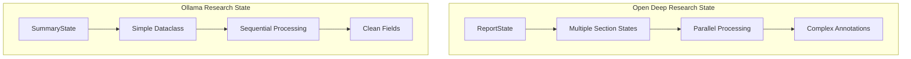
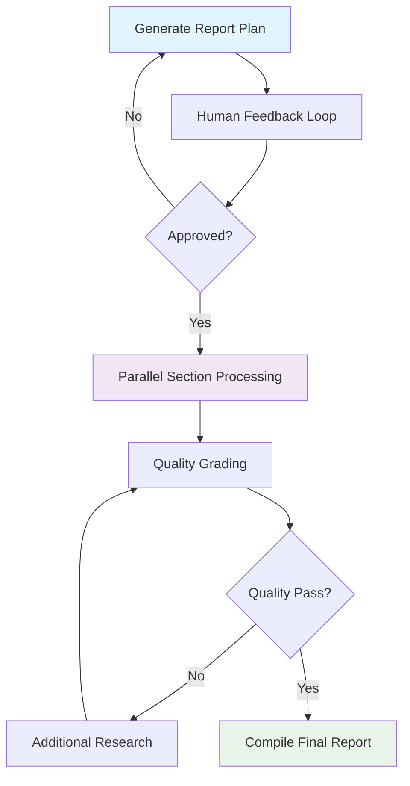
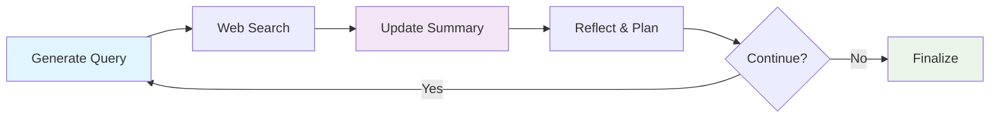
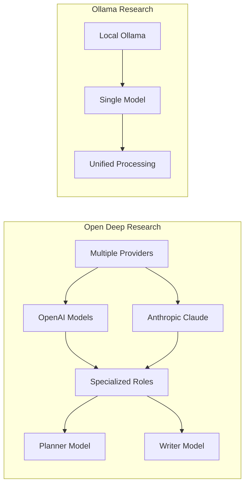
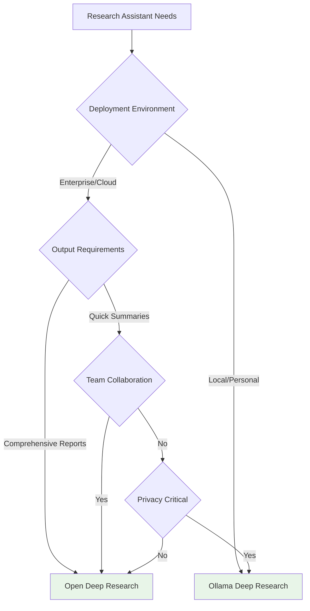

# LangGraph Deep Research: A Tale of Two Architectures

*Exploring enterprise complexity vs. local simplicity in AI research systems*

---

## Table of Contents

- [Introduction](#introduction)
- [The Two Contenders](#the-two-contenders)
- [Architecture Deep Dive](#architecture-deep-dive)
- [Workflow Comparison](#workflow-comparison)
- [Implementation Analysis](#implementation-analysis)
- [Performance & Use Cases](#performance--use-cases)
- [Which Should You Choose?](#which-should-you-choose)
- [Key Takeaways](#key-takeaways)

---

## Introduction

In the rapidly evolving landscape of AI agents, LangGraph has emerged as the go-to framework for building sophisticated, stateful AI systems. But how do different teams approach the same problem—creating research assistants that can autonomously gather and synthesize information?

Today, we'll dissect two fascinating implementations: an enterprise-grade **Open Deep Research** system and a streamlined **Ollama Deep Research Assistant**. These represent fundamentally different philosophies in AI architecture—complexity vs. simplicity, cloud vs. local, comprehensive vs. focused.

> [!important]
> This analysis is based on real production codebases totaling nearly 140KB of Python code and represents current best practices in LangGraph development.

---

## The Two Contenders

### 🏢 Open Deep Research: The Enterprise Champion
- **[Codebase](open_deep_research_compilation.md)**: 7 files, 117KB 
- **Philosophy**: Comprehensive, multi-agent orchestration
- **Target**: Enterprise research teams, academic institutions
- **Complexity**: High - designed for sophisticated research workflows

### 🏠 Ollama Deep Research: The Local Hero  
- **[Codebase](ollama_deep_research_compilation.md)**: 6 files, 21KB
- **Philosophy**: Simplicity and local deployment
- **Target**: Individual researchers, privacy-conscious users
- **Complexity**: Low - focused on essential research loops

---

## Architecture Deep Dive

Let's explore how each system approaches the fundamental challenge of building a research assistant.

### State Management Strategies

The way each system manages state reveals their core architectural philosophy:



**Open Deep Research** employs a sophisticated multi-level state hierarchy:

```python
class ReportState(TypedDict):
    topic: str
    feedback_on_report_plan: Annotated[list[str], operator.add]
    sections: list[Section]
    completed_sections: Annotated[list, operator.add] 
    report_sections_from_research: str
    final_report: str
```

This enables parallel processing of multiple report sections, human feedback integration, and complex state coordination.

**Ollama Deep Research** opts for elegant simplicity:

```python
@dataclass(kw_only=True)
class SummaryState:
    research_topic: str = field(default=None)
    search_query: str = field(default=None) 
    research_loop_count: int = field(default=0)
    running_summary: str = field(default=None)
```

Clean, readable, and sufficient for iterative research refinement.

> [!note]
> The state design choice fundamentally determines the system's capabilities—complex states enable sophisticated workflows but increase cognitive overhead.

---

## Workflow Comparison

The workflow architectures reveal strikingly different approaches to research:

### Open Deep Research: Multi-Stage Pipeline



**Key Features:**
- **Human-in-the-Loop**: Users can review and revise research plans
- **Parallel Processing**: Multiple sections researched simultaneously 
- **Quality Control**: Automated grading and iterative improvement
- **Structured Output**: Professional reports with proper citations

### Ollama Deep Research: Iterative Refinement Loop



**Key Features:**
- **Iterative Improvement**: Continuous refinement through reflection
- **Bounded Execution**: Configurable loop limits prevent runaway costs
- **Summary Building**: Accumulative knowledge synthesis
- **Local Processing**: Ollama integration for privacy

> [!done]
> Both workflows are valid LangGraph patterns—the choice depends on your specific requirements for complexity, control, and output format.

---

## Implementation Analysis

### Search API Integration: Breadth vs. Focus

**Open Deep Research** supports an impressive array of search providers:

| Provider | Use Case | Strengths |
|----------|----------|-----------|
| Tavily | General web search | Comprehensive coverage |
| ArXiv | Academic papers | Research depth |
| PubMed | Medical literature | Domain expertise |
| Perplexity | AI-powered search | Contextual understanding |
| Exa | Semantic search | Relevance matching |
| Google/Bing | Broad coverage | Mainstream results |

**Ollama Deep Research** focuses on three core providers:
- **Tavily**: Primary web search
- **Perplexity**: AI-enhanced results  
- **DuckDuckGo**: Privacy-focused alternative

### LLM Integration Approaches

The systems take markedly different approaches to language model integration:



**Open Deep Research** employs specialized models:
- **Planner Model**: Strategic research planning (o3-mini, Claude)
- **Writer Model**: Content generation and synthesis
- **Model-Specific Optimizations**: Claude thinking budgets, structured outputs

**Ollama Deep Research** uses a unified approach:
- **Single Local Model**: llama3.2 (configurable)
- **JSON Mode**: Structured output generation
- **Consistent Processing**: Same model for all tasks

---

## Performance & Use Cases

### When to Choose Open Deep Research

> [!important]
> **Ideal for**: Enterprise teams requiring comprehensive, citable research reports

**Strengths:**
- **Professional Output**: Multi-section reports with proper citations
- **Human Collaboration**: Built-in feedback and revision cycles
- **Parallel Processing**: Faster completion of complex research
- **Quality Assurance**: Automated grading and improvement loops
- **Flexibility**: 8+ search APIs, multiple LLM providers

**Example Use Cases:**
- Market research and competitive analysis
- Academic literature reviews
- Technical documentation and whitepapers
- Due diligence reports

### When to Choose Ollama Deep Research

> [!note]
> **Ideal for**: Individual researchers prioritizing privacy, simplicity, and local deployment

**Strengths:**
- **Privacy First**: All processing happens locally
- **Resource Efficient**: Minimal computational overhead
- **Simple Deployment**: Single Ollama installation
- **Quick Iteration**: Fast research loops
- **Cost Effective**: No API costs for LLM usage

**Example Use Cases:**
- Personal research and learning
- Privacy-sensitive investigations  
- Resource-constrained environments
- Rapid information gathering

---

## Which Should You Choose?

The decision ultimately depends on your specific requirements:



### Decision Matrix

| Factor | Open Deep Research | Ollama Deep Research |
|--------|-------------------|---------------------|
| **Setup Complexity** | High ⚙️⚙️⚙️ | Low ⚙️ |
| **Output Quality** | Professional 📊📊📊 | Good 📊📊 |
| **Customization** | Extensive 🔧🔧🔧 | Limited 🔧 |
| **Privacy** | Cloud-dependent 🌐 | Fully Local 🔒 |
| **Cost** | API costs 💰💰 | Hardware only 💰 |
| **Maintenance** | High 🔨🔨🔨 | Low 🔨 |

---

## Key Takeaways

After analyzing both implementations, several important insights emerge:

### For Architecture Design

1. **State Complexity**: Match state design to workflow requirements—simple states for simple workflows, complex states for sophisticated coordination

2. **LLM Strategy**: Consider whether you need specialized models for different tasks or if a unified approach suffices

3. **Search Integration**: More APIs aren't always better—focus on quality sources relevant to your domain

### For Implementation Teams

> [!warning]
> **Complexity Warning**: Enterprise features come with enterprise complexity. Ensure your team can maintain sophisticated multi-agent systems before choosing that path.

1. **Start Simple**: Begin with simpler architectures and add complexity only when justified by clear requirements

2. **Human-in-the-Loop**: Consider where human judgment adds the most value in your research workflow

3. **Local vs. Cloud**: Privacy and deployment requirements should drive architectural decisions early

### For the Future

Both implementations demonstrate that LangGraph enables fundamentally different approaches to the same problem. As the framework matures, we can expect:

- **Hybrid Approaches**: Combining local privacy with cloud capabilities
- **Specialized Components**: More domain-specific research tools
- **Enhanced Integration**: Better tooling for complex multi-agent systems

---

## Conclusion

The comparison between Open Deep Research and Ollama Deep Research illustrates a fundamental truth in software architecture: there's no one-size-fits-all solution. Each system makes deliberate trade-offs aligned with its target use case.

**Open Deep Research** showcases the power of sophisticated multi-agent orchestration for enterprise scenarios, while **Ollama Deep Research** demonstrates that thoughtful simplicity can deliver substantial value with minimal complexity.

As you design your own research assistants, consider:
- What level of output sophistication do you truly need?
- How important is human collaboration in your workflow?
- What are your privacy and deployment constraints?
- How much complexity can your team realistically maintain?

The beauty of LangGraph lies in its flexibility—it can support both architectures equally well. The key is choosing the approach that best aligns with your specific requirements and constraints.

> [!done]
> **Final Thought**: Both implementations represent solid engineering and demonstrate that good architecture is about making appropriate trade-offs, not maximizing features.

---

*Want to explore these implementations further? Both codebases provide excellent examples of LangGraph best practices and can serve as starting points for your own research assistant projects.*