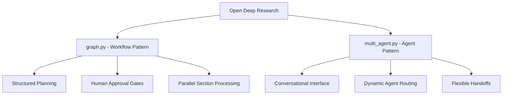
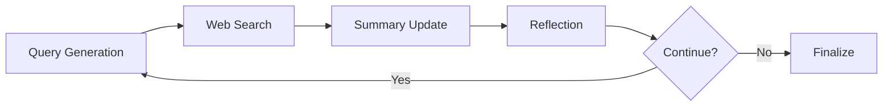

# Reference Implementations

*A comprehensive guide to official templates, prebuilt agents, community projects, and real-world implementations*

---

## Table of Contents

- [Official Templates](#official-templates)
- [Prebuilt Agents](#prebuilt-agents)
- [Official Examples](#official-examples)
- [Community Projects](#community-projects)
- [Production Implementations](#production-implementations)
- [Research & Deep Dive Systems](#research--deep-dive-systems)

---

## Official Templates

> **Source**: [LangGraph Template Applications](https://langchain-ai.github.io/langgraph/concepts/template_applications/)

LangChain maintains official starter templates for common use cases, available in both Python and JavaScript:

### Core Templates

| Template | Purpose | Python Repository | JavaScript Repository | Key Features |
|----------|---------|-------------------|----------------------|---------------|
| **New LangGraph Project** | Basic chatbot with memory | [new-langgraph-project](https://github.com/langchain-ai/new-langgraph-project) | [new-langgraphjs-project](https://github.com/langchain-ai/new-langgraphjs-project) | Simple conversation, checkpointing |
| **ReAct Agent** | Tool-using agent framework | [react-agent](https://github.com/langchain-ai/react-agent) | [react-agent-js](https://github.com/langchain-ai/react-agent-js) | Reasoning + Acting pattern |
| **Memory Agent** | Cross-thread memory persistence | [memory-agent](https://github.com/langchain-ai/memory-agent) | [memory-agent-js](https://github.com/langchain-ai/memory-agent-js) | Long-term user memory |
| **Retrieval Agent** | Knowledge-based QA system | [retrieval-agent-template](https://github.com/langchain-ai/retrieval-agent-template) | [retrieval-agent-template-js](https://github.com/langchain-ai/retrieval-agent-template-js) | RAG + agent reasoning |
| **Data Enrichment Agent** | Web search & data organization | [data-enrichment](https://github.com/langchain-ai/data-enrichment) | [data-enrichment-js](https://github.com/langchain-ai/data-enrichment-js) | Structured data gathering |

### Template Installation

```bash
# Install LangGraph CLI
pip install "langgraph-cli[inmem]" --upgrade

# Create new project from template
langgraph new
```

---

## Prebuilt Agents

> **Source**: [LangGraph 0.3 Release: Prebuilt Agents](https://blog.langchain.dev/langgraph-0-3-release-prebuilt-agents/)

LangGraph 0.3 introduced prebuilt agents for common patterns:

### Official Prebuilt Agents

| Agent | Purpose | Python Package | JavaScript Package | Key Features |
|-------|---------|----------------|-------------------|---------------|
| **Computer Use Agent** | Automate computer interactions | [langgraph-cua-py](https://pypi.org/project/langgraph-cua/) | [langgraph-cua](https://www.npmjs.com/package/@langchain/langgraph-cua) | Screen interaction, task automation |
| **Swarm Agent** | Multi-agent coordination | [langgraph-swarm-py](https://github.com/langchain-ai/langgraph-swarm-py) | [langgraph-swarm](https://www.npmjs.com/package/@langchain/langgraph-swarm) | Dynamic agent handoffs |
| **Supervisor Agent** | Hierarchical multi-agent | [langgraph-supervisor-py](https://pypi.org/project/langgraph-supervisor/) | [langgraph-supervisor](https://www.npmjs.com/package/@langchain/langgraph-supervisor) | Central coordination |
| **MCP Adapters** | Model Context Protocol | [langchain-mcp-adapters](https://pypi.org/project/langchain-mcp-adapters/) | ❌ | MCP tool integration |
| **LangMem** | Learning & adaptation | [langmem](https://pypi.org/project/langmem/) | ❌ | Agent memory evolution |
| **CodeAct** | Code generation + execution | [langgraph-codeact](https://pypi.org/project/langgraph-codeact/) | ❌ | Advanced function calling |
| **Reflection** | Self-review capabilities | [langgraph-reflection](https://pypi.org/project/langgraph-reflection/) | ❌ | Quality improvement loops |
| **BigTool** | Large tool management | [langgraph-bigtool](https://pypi.org/project/langgraph-bigtool/) | ❌ | Massive tool orchestration |

---

## Official Examples

> **Source**: [LangGraph Documentation Examples](https://langchain-ai.github.io/langgraph/)

### Tutorial Implementations

| Example | Focus | Documentation | Repository Location |
|---------|-------|---------------|-------------------|
| **Agentic RAG** | Retrieval + reasoning | [Tutorial](https://langchain-ai.github.io/langgraph/tutorials/rag/langgraph_agentic_rag/) | [Notebook](https://github.com/langchain-ai/langgraph/blob/main/examples/rag/langgraph_agentic_rag.ipynb) |
| **SQL Agent** | Database interaction | [Tutorial](https://langchain-ai.github.io/langgraph/tutorials/sql-agent/) | [Code Examples](https://langchain-ai.github.io/langgraph/tutorials/sql-agent/) |
| **Multi-Agent Supervisor** | Agent coordination | [Tutorial](https://langchain-ai.github.io/langgraph/tutorials/multi_agent/agent_supervisor/) | [Examples](https://github.com/langchain-ai/langgraph/tree/main/examples/multi_agent) |
| **Human-in-the-Loop** | Interactive workflows | [Tutorial](https://langchain-ai.github.io/langgraph/tutorials/get-started/4-human-in-the-loop/) | [How-tos](https://langchain-ai.github.io/langgraph/how-tos/human_in_the_loop/) |
| **Custom Authentication** | Security patterns | [Tutorial](https://langchain-ai.github.io/langgraph/tutorials/auth/getting_started/) | [Auth Examples](https://langchain-ai.github.io/langgraph/tutorials/auth/) |

### Production Example Applications

| Application | Purpose | Repository | Key Features |
|-------------|---------|------------|---------------|
| **ChatLangChain** | Documentation assistant | [GitHub](https://github.com/langchain-ai/chat-langchain) | RAG, semantic search, GenUI |
| **OpenGPTs** | GPT alternative platform | [GitHub](https://github.com/langchain-ai/opengpts) | 60+ LLM providers, PostgreSQL |
| **LangGraph UI Examples** | Generative UI showcase | [Examples](https://langchain-ai.github.io/langgraph/cloud/how-tos/generative_ui_react/) | React integration, custom components |
| **Agent Inbox** | Agent interaction hub | [Templates](https://langchain-ai.github.io/langgraph/concepts/template_applications/) | Real-time communication, interrupts |

---

## Community Projects

> **Source**: [Awesome LangGraph Repository](https://github.com/von-development/awesome-LangGraph)

### Community Agents & Libraries

| Project | Purpose | Repository | Stars | Features |
|---------|---------|------------|-------|-----------|
| **TrustCall** | Tenacious tool calling | [GitHub](https://github.com/von-development/awesome-LangGraph) | 766+ | Robust tool execution |
| **Delve** | Taxonomy generation | [Awesome LangGraph](https://github.com/von-development/awesome-LangGraph) | - | Unstructured data processing |
| **Nodeology** | Scientific workflows | [Awesome LangGraph](https://github.com/von-development/awesome-LangGraph) | - | Research automation |
| **Breeze Agent** | Research system | [Awesome LangGraph](https://github.com/von-development/awesome-LangGraph) | - | STORM-inspired research |

### AI Assistants & Applications

| Project | Type | Repository | Description |
|---------|------|------------|-------------|
| **LlamaBot** | Web development | [Awesome LangGraph](https://github.com/von-development/awesome-LangGraph) | HTML/CSS/JS coding agent |
| **DeerFlow** | Research framework | [Awesome LangGraph](https://github.com/von-development/awesome-LangGraph) | Community-driven deep research |
| **LangGraph Agent Template** | Production boilerplate | [GitHub](https://github.com/Leavitskiy/langgraph-agent-template) | Dockerized infrastructure |

### Development Tools

| Tool | Purpose | Repository | Features |
|------|---------|------------|-----------|
| **LangGraph Builder** | Visual design | [Official Tools](https://langchain-ai.github.io/langgraph/concepts/template_applications/) | Cognitive architecture canvas |
| **LangGraph Generator** | Code generation | [Official Tools](https://langchain-ai.github.io/langgraph/concepts/template_applications/) | YAML to code conversion |
| **LangGraph Studio** | IDE & debugging | [GitHub](https://github.com/langchain-ai/langgraph-studio) | Visual graph debugging |

---

## Production Implementations

> **Source**: [Companies Using LangGraph](https://blog.langchain.dev/is-langgraph-used-in-production/)

### Verified Production Users

| Company | Use Case | Implementation Details |
|---------|----------|----------------------|
| **LinkedIn** | Internal tooling | Multi-agent workflows for professional networking |
| **Uber** | Customer support | Agent-based support ticket routing and resolution |
| **Replit** | Code assistance | Development environment integration |
| **Elastic** | Threat detection | Security orchestration and automated response |
| **Klarna** | Customer service | Financial services automation |
| **AppFolio** | Property management | Realm-X copilot for decision support |

### Architecture Patterns in Production

| Pattern | Companies | Use Cases |
|---------|-----------|-----------|
| **Supervisor Architecture** | LinkedIn, Elastic | Task routing, security orchestration |
| **Swarm Patterns** | Uber, Klarna | Distributed problem solving |
| **RAG + Agents** | Replit, AppFolio | Knowledge-augmented assistance |

---

## Research & Deep Dive Systems

### Comprehensive Research Implementations

| System | Repository | Complexity | Focus Area |
|--------|------------|------------|------------|
| **Open Deep Research** | [GitHub](https://github.com/langchain-ai/open_deep_research) | High (117KB) | Enterprise research workflows |
| **Ollama Deep Research** | [GitHub](https://github.com/langchain-ai/local-deep-researcher) | Low (21KB) | Local privacy-focused research |

#### Open Deep Research - Dual Implementation



**Key Features**:
- **Dual Architecture**: Demonstrates both workflow-first and agent-first patterns
- **8+ Search APIs**: Tavily, Perplexity, ArXiv, PubMed, Google, DuckDuckGo, Exa, Linkup
- **Enterprise Features**: Human-in-the-loop, quality grading, parallel processing
- **Production Ready**: 3.5k stars, actively maintained

#### Ollama Deep Research - Simplicity Focus



**Key Features**:
- **Local Deployment**: Complete privacy with Ollama integration
- **Minimal Dependencies**: Single model, streamlined workflow
- **Fast Iteration**: 3-loop research cycles with reflection
- **Community Favorite**: 7.5k stars, beginner-friendly

---

## Implementation Patterns Summary

### By Complexity Level

| Level | Examples | Best For |
|-------|----------|----------|
| **Beginner** | New Project, Basic Chatbot | Learning, prototyping |
| **Intermediate** | ReAct Agent, Memory Agent | Production apps, specific domains |
| **Advanced** | Multi-Agent Supervisor, Open Deep Research | Enterprise, complex workflows |
| **Expert** | Custom Architectures, Platform Integration | Specialized requirements |

### By Use Case

| Use Case | Recommended Implementations | Key Examples |
|----------|---------------------------|--------------|
| **Conversational AI** | New Project, Memory Agent | ChatLangChain, Basic templates |
| **Tool-Using Agents** | ReAct Agent, Computer Use | SQL Agent, Web search agents |
| **Research & Analysis** | Data Enrichment, Deep Research | Open/Ollama Deep Research |
| **Multi-Agent Systems** | Supervisor, Swarm patterns | Production implementations |
| **Knowledge Management** | Retrieval Agent, Agentic RAG | Documentation assistants |

### By Deployment Model

| Model | Examples | Characteristics |
|-------|----------|----------------|
| **Local/Privacy** | Ollama Deep Research | On-premise, data control |
| **Cloud/Scalable** | LangGraph Platform | Managed infrastructure |
| **Hybrid** | Self-hosted options | Custom infrastructure |

---

## Sources and References

1. **[LangGraph Official Documentation](https://langchain-ai.github.io/langgraph/)** - Complete framework documentation
2. **[LangGraph Templates](https://langchain-ai.github.io/langgraph/concepts/template_applications/)** - Official starter templates
3. **[Awesome LangGraph](https://github.com/von-development/awesome-LangGraph)** - Community project index (766+ stars)
4. **[LangGraph 0.3 Release](https://blog.langchain.dev/langgraph-0-3-release-prebuilt-agents/)** - Prebuilt agents announcement
5. **[Production Case Studies](https://blog.langchain.dev/is-langgraph-used-in-production/)** - Real-world implementations
6. **[LangChain GitHub](https://github.com/langchain-ai/langgraph)** - Main repository with examples

---

*This landscape represents the complete ecosystem of LangGraph implementations, from simple templates to complex production systems. Each category offers different entry points and scaling paths for various use cases and expertise levels.*