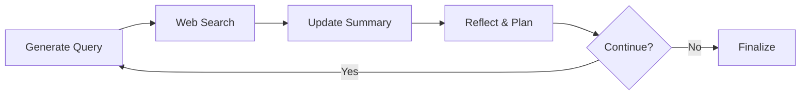
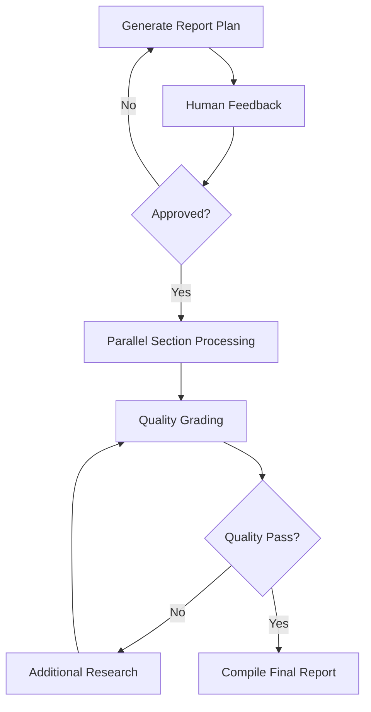

# Supplementary Material: Core Terms & Concepts

## Table of Contents
- [Core Architecture](#core-architecture)
- [State Management](#state-management)
- [Execution Patterns](#execution-patterns)
- [Persistence & Memory](#persistence--memory)
- [Agent Coordination](#agent-coordination)
- [Research-Specific Components](#research-specific-components)
- [Platform & Deployment](#platform--deployment)

---

## Core Architecture

### StateGraph
> **Definition**: The foundational graph structure in LangGraph that models workflows as connected nodes and edges.

**Key Features**:
- Models agent workflows as directed graphs
- Supports both cyclic and acyclic workflows
- Enables complex control flow with conditional routing
- **Source**: [LangGraph Low-Level Concepts](https://langchain-ai.github.io/langgraph/concepts/low_level/)

**Deep Research Usage**: Primary orchestration framework for both simple (local) and complex (enterprise) research workflows.

### Nodes
> **Definition**: Functions that represent discrete computation steps in a LangGraph workflow.

**Characteristics**:
- Each node is a function that takes state and returns updated state
- Can be synchronous or asynchronous
- Support tool calling, LLM interactions, and custom logic
- **Source**: [LangGraph Core Concepts](https://langchain-ai.github.io/langgraph/concepts/low_level/)

**Deep Research Examples**:
- `generate_queries`: Creates search queries for research
- `web_search`: Executes web searches using various APIs
- `write_section`: Generates report sections from gathered information

### Edges
> **Definition**: Connections between nodes that define workflow execution paths.

**Types**:
- **Normal Edges**: Direct node-to-node connections
- **Conditional Edges**: Route execution based on state conditions
- **Send API**: Dynamic edge creation for parallel execution
- **Source**: [LangGraph Graph API](https://langchain-ai.github.io/langgraph/how-tos/graph-api/)

---

## State Management

### State Schema
> **Definition**: The data structure that flows through the graph and persists information across nodes.

**Implementation Patterns**:
```python
# Simple State (Ollama Deep Research)
@dataclass(kw_only=True)
class SummaryState:
    research_topic: str
    search_query: str
    running_summary: str
    research_loop_count: int

# Complex State (Open Deep Research)  
class ReportState(TypedDict):
    topic: str
    sections: list[Section]
    completed_sections: Annotated[list, operator.add]
    final_report: str
```

**Deep Research Context**: State complexity directly correlates with workflow sophistication - simple iterative loops vs. parallel section processing.

### Reducers
> **Definition**: Functions that combine multiple state updates from parallel nodes.

**Common Patterns**:
- `operator.add`: Combines lists (e.g., accumulated search results)
- `operator.or_`: Merges dictionaries
- Custom reducers for domain-specific merging logic
- **Source**: [LangGraph State Management](https://langchain-ai.github.io/langgraph/concepts/low_level/)

---

## Execution Patterns

### Send API
> **Definition**: Mechanism for dynamic parallel execution of multiple nodes with different inputs.

**Key Features**:
- Creates dynamic fan-out patterns
- Each sent node runs with its own input
- Results merged back to parent state
- **Source**: [LangGraph Send API Documentation](https://langchain-ai.github.io/langgraph/tutorials/workflows/)

**Deep Research Usage**: Parallel section processing in enterprise implementations:
```python
return [
    Send("build_section_with_web_research", {"topic": topic, "section": s}) 
    for s in sections if s.research
]
```

### Command
> **Definition**: Return type that provides fine-grained control over graph execution flow.

**Capabilities**:
- Route to specific nodes: `Command(goto="node_name")`
- Update state: `Command(update={"key": "value"})`
- Combine routing and updates
- **Source**: [LangGraph Command Documentation](https://langchain-ai.github.io/langgraph/concepts/low_level/#command)

### Conditional Routing
> **Definition**: Logic that determines the next node based on current state conditions.

**Research Patterns**:
- Quality gates: Route to revision or completion based on content quality
- Loop control: Continue research or finalize based on iteration count
- Agent handoffs: Route between different specialized agents

---

## Persistence & Memory

### Checkpointer
> **Definition**: LangGraph's persistence layer that saves graph state at each execution step.

**Types**:
- **MemorySaver**: In-memory persistence for development
- **SqliteSaver**: Local file-based persistence
- **PostgresSaver**: Production database persistence
- **Source**: [LangGraph Persistence](https://langchain-ai.github.io/langgraph/concepts/persistence/)

**Deep Research Benefits**:
- Resume interrupted research workflows
- Support human-in-the-loop review cycles
- Enable conversation context across multiple research sessions

### Threads
> **Definition**: Unique conversation sessions that maintain independent state histories.

**Key Concepts**:
- Each thread has its own checkpoint history
- Thread IDs enable session isolation
- Support time travel and state inspection
- **Source**: [LangGraph Threads Concept](https://langchain-ai.github.io/langgraph/cloud/concepts/threads/)

### Short-term vs Long-term Memory
> **Definition**: Different scopes of information persistence in research systems.

**Short-term Memory**:
- Thread-scoped conversation history
- Research context within a single session
- Managed through checkpointers

**Long-term Memory**:
- Cross-session user preferences
- Accumulated knowledge across research topics
- Implemented via stores (e.g., semantic search)
- **Source**: [LangGraph Memory Concepts](https://langchain-ai.github.io/langgraph/concepts/memory/)

---

## Agent Coordination

### Multi-Agent Architectures

#### Supervisor Pattern
> **Definition**: Central coordinator that manages multiple specialized worker agents.

**Structure**:
- Supervisor agent routes tasks to specialists
- Worker agents handle domain-specific functions
- Centralized control flow and coordination
- **Source**: [LangGraph Multi-Agent Systems](https://langchain-ai.github.io/langgraph/concepts/multi_agent/)

#### Network Pattern
> **Definition**: Peer-to-peer agent communication where each agent can contact any other.

**Characteristics**:
- Agents can directly handoff to each other
- Decentralized coordination
- Complex communication patterns possible

### Handoffs
> **Definition**: Mechanism for transferring control between agents in multi-agent systems.

**Implementation**:
```python
@tool(return_direct=True)
def transfer_to_hotel_advisor():
    """Ask hotel advisor agent for help."""
    return "Successfully transferred to hotel advisor"
```

**Deep Research Context**: Enables specialized agents for different research domains (travel, technical, academic).

---

## Research-Specific Components

### Search API Integration
> **Definition**: Abstraction layer for multiple web search providers in research workflows.

**Supported APIs** (from analyzed codebases):
- **Tavily**: General web search with content extraction
- **Perplexity**: AI-powered search with synthesis
- **ArXiv**: Academic paper search
- **PubMed**: Medical literature search
- **DuckDuckGo**: Privacy-focused search
- **Google Search**: Comprehensive web coverage

### Research Loop Patterns

#### Iterative Refinement (Ollama Deep Research)


#### Plan-Execute-Review (Open Deep Research)


### Human-in-the-Loop (HITL)
> **Definition**: Mechanisms for incorporating human feedback and approval in automated workflows.

**Key Functions**:
- `interrupt()`: Pause execution for human input
- Breakpoints: Debug and inspect workflow state
- Plan approval: Human review of research strategies
- **Source**: [LangGraph Human-in-the-Loop](https://langchain-ai.github.io/langgraph/concepts/human_in_the_loop/)

---

## Platform & Deployment

### LangGraph Platform
> **Definition**: Cloud infrastructure for deploying and scaling LangGraph applications.

**Key Features**:
- Managed infrastructure for agent workflows
- Built-in persistence and memory management
- Streaming support for real-time interactions
- Background task execution
- **Source**: [LangGraph Platform Overview](https://langchain-ai.github.io/langgraph/concepts/langgraph_platform/)

**Pricing** (verified 2024):
- Development: $0.0007/minute per deployment
- Production: $0.0036/minute per deployment
- **Source**: [LangGraph Platform Pricing](https://www.langchain.com/pricing-langgraph-platform)

### Deployment Options
1. **Cloud SaaS**: Fully managed by LangChain
2. **Self-Hosted**: Customer-managed infrastructure
3. **Bring Your Own Cloud (BYOC)**: Hybrid approach
4. **Standalone Container**: Local or container deployment
- **Source**: [LangGraph Deployment Options](https://langchain-ai.github.io/langgraph/concepts/deployment_options/)

### LangGraph Studio
> **Definition**: IDE for visualizing, debugging, and testing LangGraph workflows.

**Features**:
- Visual graph representation
- Step-by-step execution debugging
- State inspection and modification
- Integration with LangSmith tracing
- **Source**: [LangGraph Studio Documentation](https://langchain-ai.github.io/langgraph/concepts/langgraph_studio/)

---

## Performance Considerations

### Streaming
> **Definition**: Real-time output delivery during workflow execution.

**Stream Modes**:
- **Updates**: State changes after each node
- **Values**: Complete state after each step
- **Messages**: LLM token-by-token output
- **Custom**: User-defined streaming data
- **Source**: [LangGraph Streaming](https://langchain-ai.github.io/langgraph/concepts/streaming/)

### Scalability Patterns
- **Parallel Processing**: Send API for concurrent operations
- **Subgraphs**: Modular, reusable workflow components
- **Async Execution**: Non-blocking I/O operations
- **Checkpointing**: Fault tolerance and resumability

---

## Sources and References

All terms and concepts in this appendix are grounded in official LangGraph documentation and verified open-source implementations:

1. **Primary Documentation**: [LangGraph Official Docs](https://langchain-ai.github.io/langgraph/)
2. **Open Deep Research**: [GitHub Repository](https://github.com/langchain-ai/open_deep_research) (3.5k stars, 117KB)
3. **Local Deep Researcher**: [GitHub Repository](https://github.com/langchain-ai/local-deep-researcher) (7.5k stars, 21KB)
4. **LangGraph Platform**: [Official Platform Documentation](https://www.langchain.com/langgraph-platform)
5. **Production Usage**: [Companies Using LangGraph](https://blog.langchain.dev/is-langgraph-used-in-production/)

---

*This appendix provides the essential vocabulary for understanding and implementing Deep Research systems with LangGraph. Each term is defined in the context of real-world research workflows and backed by documented implementations.*