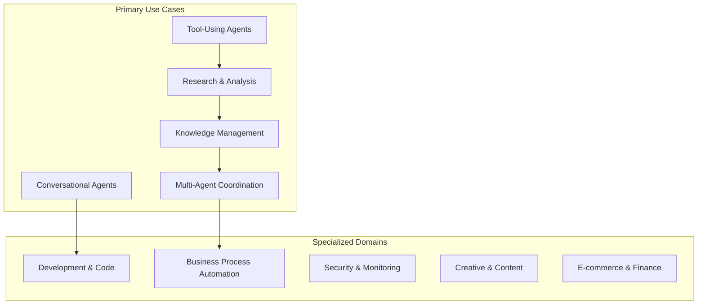
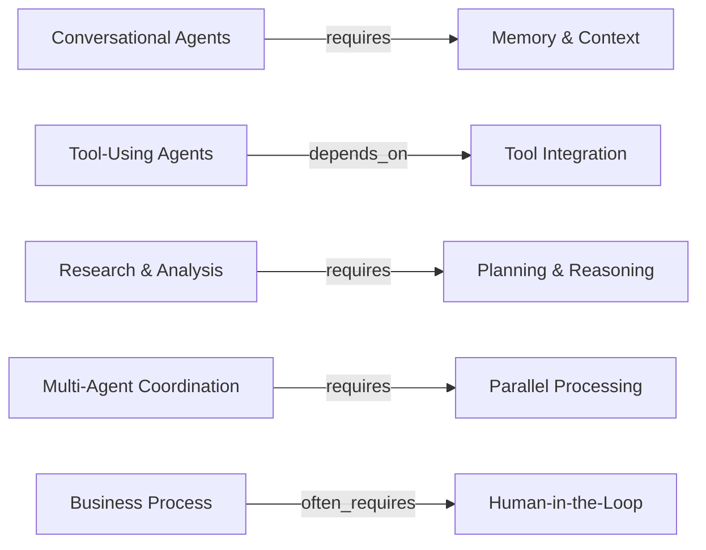
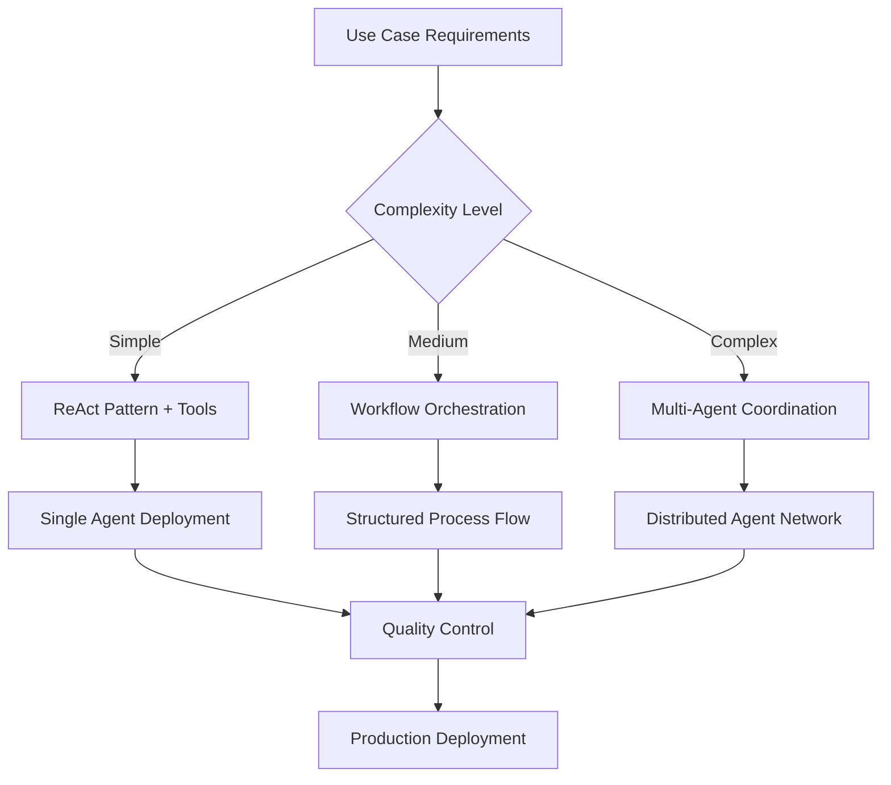

# Use Cases for Agentic Systems

*A structured map of the agentic AI landscape based on real-world implementations and production systems*

---

## Knowledge Graph Overview

This knowledge graph captures the essential use cases, capabilities, and architectural patterns for agentic systems, derived from analysis of LangGraph implementations, production deployments, and community projects.

**Graph Structure**: 20 entities connected by 24 relationships across 4 major categories.

---

## 🎯 Use Case Categories

### Core Application Domains

### 1. **Conversational Agents**
- **Purpose**: Human-like interaction and assistance
- **Examples**: ChatLangChain, customer service bots, personal assistants
- **Key Requirements**: Memory, context awareness, natural dialogue
- **Production Users**: Klarna (customer service), general chatbot platforms

### 2. **Tool-Using Agents**
- **Purpose**: External system interaction and automation
- **Examples**: ReAct agents, API orchestration, computer use automation
- **Key Requirements**: Function calling, reasoning about tool use
- **Production Users**: GitHub Copilot-style systems, automation platforms

### 3. **Research & Analysis**
- **Purpose**: Information gathering and synthesis
- **Examples**: Open Deep Research, academic research automation
- **Key Requirements**: Web search, data processing, multi-source analysis
- **Production Users**: Research institutions, competitive intelligence

### 4. **Knowledge Management**
- **Purpose**: Information storage, retrieval, and Q&A
- **Examples**: RAG systems, document assistants, knowledge bases
- **Key Requirements**: Vector search, semantic matching, context grounding
- **Production Users**: Enterprise documentation systems

### 5. **Multi-Agent Coordination**
- **Purpose**: Complex task orchestration across multiple agents
- **Examples**: Supervisor systems, swarm collaboration
- **Key Requirements**: Agent communication, task delegation, coordination
- **Production Users**: LinkedIn (workflow automation), Uber (distributed systems)

### 6. **Development & Code**
- **Purpose**: Programming assistance and automation
- **Examples**: SQL agents, code generation, automated testing
- **Key Requirements**: Code understanding, API integration, testing frameworks
- **Production Users**: Replit (coding assistance), development tools

### 7. **Business Process Automation**
- **Purpose**: Workflow automation and business logic
- **Examples**: Email management, approval workflows, scheduling
- **Key Requirements**: Process orchestration, human oversight, integration
- **Production Users**: Enterprise workflow systems

### 8. **Security & Monitoring**
- **Purpose**: Threat detection and incident response
- **Examples**: Automated security operations, log analysis
- **Key Requirements**: Real-time processing, pattern recognition, alerting
- **Production Users**: Elastic (threat detection), security operations centers

### 9. **Creative & Content**
- **Purpose**: Content generation and creative assistance
- **Examples**: Writing assistance, media production, design tools
- **Key Requirements**: Creativity evaluation, human collaboration
- **Production Users**: Content marketing platforms, creative tools

### 10. **E-commerce & Finance**
- **Purpose**: Customer service and transaction processing
- **Examples**: Financial advisory, fraud detection, personalized shopping
- **Key Requirements**: Regulatory compliance, security, scalability
- **Production Users**: Klarna (financial services), e-commerce platforms

---

## ⚙️ Core Capabilities

### Essential Technical Components

| Capability | Purpose | Required By | Key Features |
|------------|---------|-------------|--------------|
| **Memory & Context** | Multi-turn conversations, personalization | Conversational Agents, Creative Content | Short-term, long-term, cross-session persistence |
| **Human-in-the-Loop** | Quality control, approval workflows | Business Process, Creative Content | Interrupts, approval gates, interactive guidance |
| **Tool Integration** | External system interaction | Tool-Using Agents, Research, Development | API calling, database queries, file operations |
| **Planning & Reasoning** | Complex task decomposition | Research, Development, Multi-Agent | Goal setting, strategy formulation, adaptive planning |
| **Parallel Processing** | Concurrent task execution | Multi-Agent, Security, Large-scale systems | Distributed coordination, load balancing |

### Capability Dependencies

---

## 🏗️ Agent Architectures

### Fundamental Design Patterns

### 1. **ReAct Pattern**
- **Approach**: Reasoning and Acting in cycles
- **Structure**: Thought → Action → Observation → Repeat
- **Best For**: Tool-using agents, single-agent systems
- **Examples**: Most LangGraph templates, SQL agents

### 2. **Supervisor Architecture**
- **Approach**: Central coordinator with specialized workers
- **Structure**: Supervisor → Route → Worker → Report → Supervisor
- **Best For**: Complex task distribution, quality oversight
- **Examples**: LinkedIn's production systems, Elastic's security orchestration

### 3. **Swarm Architecture**
- **Approach**: Peer-to-peer agent collaboration
- **Structure**: Agent ↔ Agent ↔ Agent (dynamic handoffs)
- **Best For**: Emergent behavior, flexible task distribution
- **Examples**: Research systems, distributed problem solving

### 4. **Workflow Orchestration**
- **Approach**: Explicit state machines with defined transitions
- **Structure**: Plan → Execute → Review → Approve → Complete
- **Best For**: Business processes, auditable workflows
- **Examples**: Open Deep Research (graph.py), approval systems

---

## 🔗 Integration Patterns

### **RAG Integration**
- **Purpose**: Combine agents with knowledge retrieval
- **Pattern**: Query → Retrieve → Generate → Respond
- **Applications**: Knowledge management, document Q&A
- **Examples**: Retrieval agents, ChatLangChain

---

## 🚀 Deployment Models

### Infrastructure Approaches

| Model | Characteristics | Best For | Examples |
|-------|----------------|----------|----------|
| **Local Deployment** | Privacy, control, cost-effective | Personal use, sensitive data | Ollama Deep Research |
| **Cloud Platform** | Managed, scalable, enterprise features | Production systems | LangGraph Platform |
| **Hybrid Architecture** | Combined local + cloud | Custom requirements | Enterprise implementations |

---

## 📊 Operational Requirements

### Production Considerations

### **Quality Control**
- **Components**: Testing, validation, human review, monitoring
- **Critical For**: Finance, security, business processes
- **Implementation**: Automated testing, approval workflows, performance metrics

### **Scalability**
- **Components**: Horizontal scaling, load balancing, fault tolerance
- **Required By**: E-commerce, finance, multi-agent systems
- **Implementation**: Cloud platforms, distributed architectures

---

## 🔄 Key Relationship Patterns

### **Dependency Chains**
1. **Simple Agents**: Tool Integration → ReAct Pattern → Specific Use Case
2. **Complex Systems**: Planning → Multi-Agent → Parallel Processing → Scalability
3. **Enterprise Systems**: Human-in-the-Loop → Quality Control → Production Deployment

### **Enhancement Relationships**
- Memory & Context enhances Conversational Agents
- RAG Integration enhances Knowledge Management
- Planning & Reasoning enables Multi-Agent Coordination

### **Architecture Flows**

---

## 🎯 Strategic Insights

### **Hub Nodes** (Most Connected)
1. **Tool Integration**: Central to most use cases
2. **Quality Control**: Critical for production systems
3. **Multi-Agent Coordination**: Enables complex orchestration

### **Domain Specialization Patterns**
- **High-Stakes Domains** (Finance, Security): Require robust quality control
- **Creative Domains**: Benefit from human-in-the-loop collaboration
- **Technical Domains** (Development, Research): Heavily depend on tool integration

### **Architectural Evolution Path**
1. **Start**: Simple conversational agents with memory
2. **Add**: Tool integration for external capabilities
3. **Scale**: Multi-agent coordination for complex tasks
4. **Productionize**: Quality control and deployment automation

---

## 🚀 Implementation Guidance

### **Choosing Your Architecture**

| If Your Use Case Is... | Start With... | Scale To... |
|------------------------|---------------|-------------|
| Customer interaction | Conversational + Memory | + Tool Integration |
| Data processing | Tool-Using + ReAct | + Workflow Orchestration |
| Complex research | Research + Planning | + Multi-Agent Coordination |
| Business automation | Workflow + Human-in-Loop | + Quality Control |
| Multi-domain tasks | Supervisor Architecture | + Swarm Collaboration |

### **Production Readiness Checklist**
- ✅ Quality Control mechanisms
- ✅ Human-in-the-Loop where needed
- ✅ Scalability planning
- ✅ Appropriate deployment model
- ✅ Tool integration security
- ✅ Memory and context management

---

## 📚 Sources & References

This knowledge graph is synthesized from:
- **LangGraph Official Documentation** and templates
- **Production Case Studies** (LinkedIn, Uber, Replit, Elastic, Klarna)
- **Open Source Implementations** (Open Deep Research, Ollama Deep Research)
- **Community Projects** (Awesome LangGraph, 766+ stars)
- **Research Papers** and agentic AI literature

---

*This knowledge graph provides a structured foundation for understanding agentic systems and designing appropriate solutions for specific domains and requirements.*